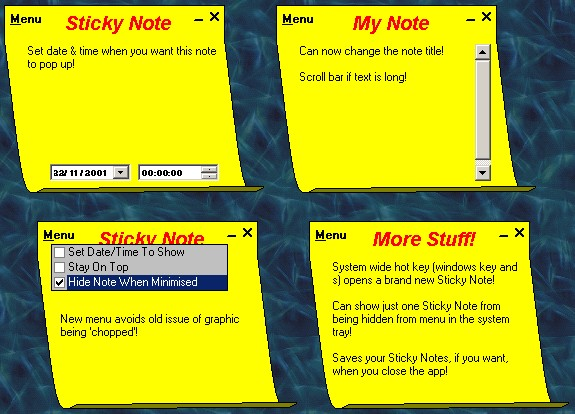



## Updated Sticky Notes

### Description

This program, which loads in to the system tray, allows you to put 'post-it notes' on your desktop to remind you about stuff you have got to do. Features a date/time function for a Sticky Note to pop up and remind you what you wrote in it. Can be minimised and hidden, or minimised to the task bar depending on what you select.

New for this release:

1. Can change the title of your note

2. Can select to view just one of your notes when hidden, rather than 'Show All'

3. Graphics problems fixed

4. Scroll bar if text is too long

5. Saves your notes if you exit and loads them again when you restart.

Thanks to all of you who voted for me for the last release - first time I have even made it on to the board for the Coding Contest! :o)
 
### More Info
 

             |
---                |---
**Submitted On**   |2001-11-23 12:05:10
**By**             |[Wamdue Project](https://github.com/Planet-Source-Code/PSCIndex/blob/master/ByAuthor/wamdue-project.md)
**Level**          |Intermediate
**User Rating**    |4.8 (19 globes from 4 users)
**Compatibility**  |VB 6\.0
**Category**       |[Complete Applications](https://github.com/Planet-Source-Code/PSCIndex/blob/master/ByCategory/complete-applications__1-27.md)
**World**          |[Visual Basic](https://github.com/Planet-Source-Code/PSCIndex/blob/master/ByWorld/visual-basic.md)
**Archive File**   |[Updated\_St3688911232001\.zip](https://github.com/Planet-Source-Code/wamdue-project-updated-sticky-notes__1-29097/archive/master.zip)

